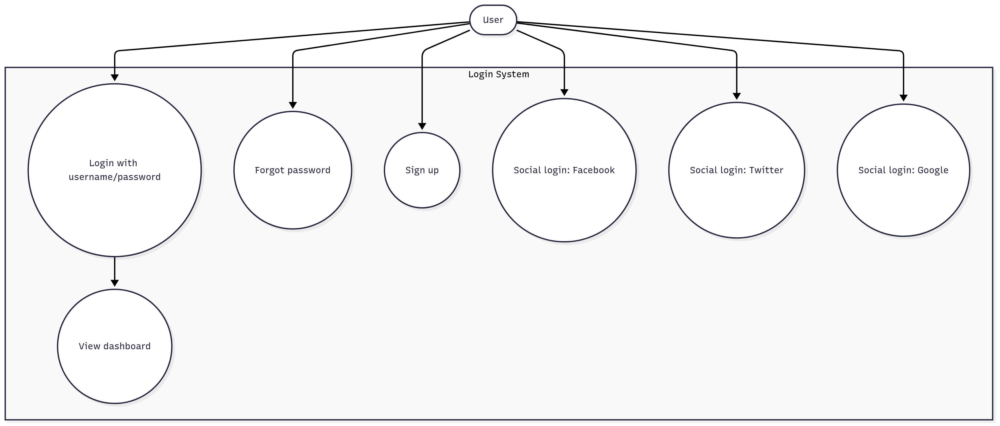

Lab 03 – Testing Login Form (Selenium + pytest)

Sinh viên: NGUYEN DO TU MAI — MSSV: N23DCPT091

Cấu trúc

lab03-login/
├─ login.html
├─ tests/
│ └─ test_login_form.py
├─ screenshots/
├─ report.html
└─ TestCases.xlsx

Yêu cầu & Phạm vi test

Form: Username, Password, nút LOGIN, link Forgot password?, SIGN UP, 3 nút social (Facebook, Twitter, Google).

6 test case: login thành công; sai mật khẩu; trống username; trống password; forgot; signup; kiểm tra social.

Locator dùng ID: username, password, login-btn, forgot-link, signup-link, social-facebook|twitter|google, message.

Cách chạy

Tạo môi trường ảo: python -m venv .venv

Kích hoạt (Windows): .venv\Scripts\activate

Cài gói: pip install -U pip và pip install selenium webdriver-manager pytest pytest-html

Chạy test: pytest -q

Xuất báo cáo: pytest -q --html=report.html --self-contained-html

Use Case (Mermaid)

usecaseDiagram
actor User
rectangle "Login System" {
User --> (Login with username/password)
(Login with username/password) --> (View dashboard)
User --> (Forgot password)
User --> (Sign up)
User --> (Social login: Facebook)
User --> (Social login: Twitter)
User --> (Social login: Google)
}

Ghi chú

Demo credentials: student / Secret123!.

Ảnh chạy test lưu tại thư mục screenshots/.
Live demo (GitHub Pages):
https://tumainguyen.github.io/n23dcpt091-lab03-login/login.html

Tác giả: NGUYEN DO TU MAI – MSSV: N23DCPT091

